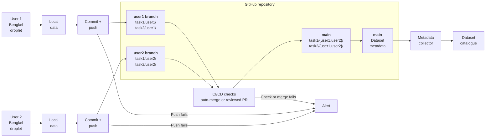
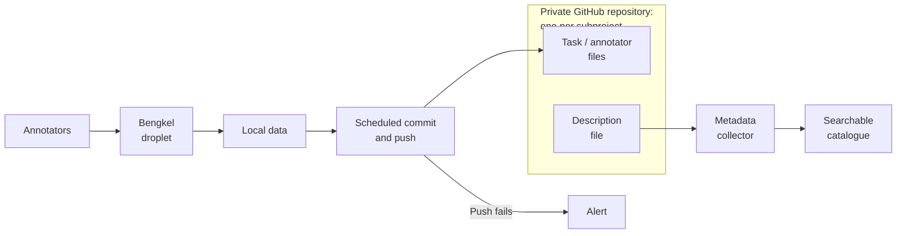
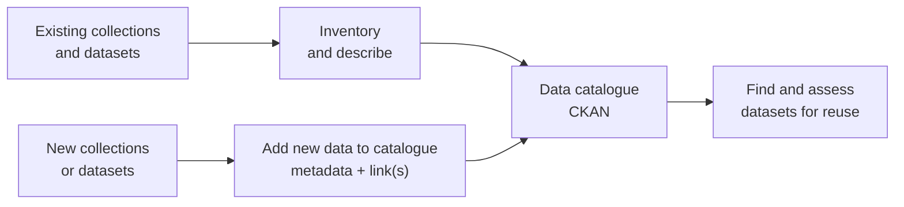

# Project - Dataset management

> **Imported Notion snapshot for review:** Content below comes from the owner's “Dataset management”; it is not approved team documentation or a live task tracker. 

## Purpose and outcome

*Plan and track a coherent approach to dataset discovery, lineage, versioning, annotation, and reuse across the [‣](https://app.notion.com/p/35f9789a0bf88093a7e2e91e0de288a3?pvs=21)  and related research.*

## Where to act

*Do not duplicate issue assignments or issue status here. The project `status` property describes the project as a whole.*

- [Data portal](https://github.com/nus-dh/data-portal)
- [Template repository for datasets](https://github.com/nus-dh/tpl-dataset)
- Issues: no specific issue link in the Notion export.

## Open actions

> **Notion snapshot:** These checkboxes and due dates reproduce the export; verify their current state in GitHub before using them as follow-ups.

*Keep action items visible and updated with the most recent at the top. Move the completed actions into the completed section. Create separate tasks when relevant. Record Who, What, By when, Task (as applicable).*

- [ ]  [Who] — [What] (by [date, if agreed])
- [x]  @Zé Miguel Vieira will do a local ~~CKAN~~ data portal (and check with Alvin) by 1 October 2026
- [ ]  @alvin will write user flow specifications by 1 October 2026
- [ ]  @alvin will share the repo for search
- [ ]  @Miguel Varela will share the “bengkel” repo

## Context and knowledge

### Original Notion properties

Assignee: Zé Miguel Vieira  
Person: Jose  
Status: In progress

### Resources

- GitHub
    - [Data portal](https://github.com/nus-dh/data-portal)
    - [Template repository for datasets](https://github.com/nus-dh/tpl-dataset)
- https://ckan.org/
- https://datasette.io/
- https://www.portaljs.com/
- https://docs.github.com/en/repositories/creating-and-managing-repositories/creating-a-template-repository
- https://datapackage.org/standard/data-package/

### Overview

Dataset management has grown organically around GitHub. A new repository is often created whenever annotated data is returned or a new dataset variant is needed. Git provides useful file history and versioning within each repository, but the collection now contains close to 100 of mostly disjoint dataset repositories and no dependable layer showing how they relate.

As a result, it is often unclear:

- which dataset or version is the most recent or canonical one;
- which source dataset a subset or derived dataset came from;
- what research task, annotation scheme, or use case a dataset supports;
- whether a dataset is in selection, annotation, review, completed, or superseded state;
- who is working on it and who is responsible for the next hand-off;
- whether two repositories are independent datasets, versions of one dataset, or overlapping subsets;
- which datasets are suitable for reuse in projects such as [LLM based reconstruction](https://app.notion.com/p/LLM-based-reconstruction-3af9789a0bf8801abf0af58cd6fd3719?pvs=21) or [Jawi - Rumi](https://app.notion.com/p/Jawi-Rumi-3e39789a0bf88066811bd04d8aa74315?pvs=21) .

### Current workflow

1. **PI** selects a subset from a larger source dataset, and **assigns it to a user**.
2. The user works on that subset and adds annotations for a particular research task.
3. The principal investigator manually retrieves the completed annotated material.
4. A new dataset repository is created on GitHub.
5. The relationship between the source, selected subset, annotation task, researcher, and resulting repository is not consistently recorded in one place.

This makes GitHub the storage and versioning layer, the dataset catalogue, and the workflow tracker at the same time, without consistent conventions across those roles.

### Desired workflow

*These are requirements to clarify, not a chosen implementation:*

- A selected subset remains traceable to its source dataset and selection criteria (**data might also be merged from two sources)**.
- Work is versioned and synchronised during the annotation period rather than only collected manually at the end.
- Dataset purpose, supported use cases, annotation scheme, ownership, status, and lineage are visible without inspecting many repositories.
- Completed, active, superseded, and experimental datasets can be distinguished.
- Researchers can identify the appropriate current dataset without relying on institutional memory.
- Git can continue to provide version history where useful while a higher-level view connects datasets across repositories and research efforts.

### Open questions

- What is the right repository boundary: one repository per dataset, annotation task, user, or another unit?
- If a repository contains several tasks or users, should they be separated through folders, branches, or another structure?
- How should source datasets, subsets, annotations, transformations, and releases express their lineage?
- What metadata is required to state intended and unsuitable use cases?
- Should a higher-level catalogue use CKAN, a simpler catalogue or registry, or stricter GitHub conventions alone?
- How should automatic synchronisation work during annotation, including access control, validation, conflicts, and incomplete work?
- What rules determine when an annotated subset becomes a new dataset, a new version, or a contribution back to its parent?
- How should the existing repositories be inventoried and reconciled without losing provenance?

### Repositories implementation suggestion

- Collections datasets stay entirely on the database and bucket realms.
- These 3 are separate repos
    - task034
        - this the data without annotations → provenance linked to a collection dataset. inside this there is file that explains what task034 is (how it was generated, and how it refers to a larger dataset.
    - task034_frial
    - task034_syafiq
- Use one private GitHub repository per subproject, `ds-theatre-studies`, with a folder for each task and a folder for each annotator inside it, for example, `location/user1/` and `location/user2/`.
    - MEV: this might create a synchronization problem, as user1 and user2 will be working from two separate droplets
- A droplet hosts several tasks. Where possible, one droplet would handle all tasks for a subproject. Bengkel would save work locally; a scheduled job would export the annotations and push them to the repository. Failed pushes should be reported.
    - MEV: I prefer to have one droplet per user, to simplify authentication. And there are many more tasks than users. Also, I want a user to keep track of different tasks.
- Each repository must have a small description file with its purpose, owner, status, source data, annotation scheme, and access restrictions. Those files could feed a searchable private catalogue, starting with a simple site rather than CKAN.
- If tasks from one subproject need to run on different droplets, each droplet could use its own Git branch and the work could be combined later. Docker Compose is optional; its value would be making new droplets easier to set up.
    - [Sample subproject repo](https://github.com/culturalheritagenus/ds-jmv)
        - branch:user1
            - location/user1
            - keywords/user1
        - branch:user2
            - location/user2
            - keywords/user2
        - main:
            - location/
                - user1
                - user2
            - keywords/
                - user1
                - user2

#### Architecture

##### Architecture for multi-user Bengkel

## Decisions

_No decisions from the Notion export have been approved for this wiki. The dated discussion and proposals are preserved below and above as source material, not adopted policy._

## Project log

*Record dated developments and completed follow-ups, newest first. Link to sources and GitHub issues rather than copying issue updates; distinguish proposals from agreed decisions.*

### 6 October 2026

- The `tpl-dataset` now follows the `Data Package 2.0` (`datapackage.json`) and contains an example and validation scripts. The type of data is set by using a configurable controlled vocabulary.
- The portal has been updated to match those changes.

*Screenshot omitted from this wiki: the source image shows dataset entries marked RESTRICTED. A sanitized replacement is needed before including it here.*

### 5 October 2026

- Updated the `tpl-dataset` to include the changes discussed at the meeting and make it compatible with `Data Package 2.0`.
- Roles are now a pre-defined keyword: `stage:master`, `stage:curated`, `stage:annotated`
- Added fields for creation date (`created`), author (`contributors.roles`)

*Meeting notes:*

- Types of data
    - Top-level: initial project data; databases + storage
    - Second-level: Curated selection of data from different sources
    - Third-level: Copy of second-level data + annotations
- Second and third-levels would make use of the template dataset
- Roles
    - Top-level: master
    - Second-level: curated/curation
    - Third-level: task
    - Role names to be defined
- Have different templates for different levels or just enforce validation?
- `metadata.json`:
    - Add a timestamp
    - Add an author field?
- Remove `task` from the template and describe that the data lives at the root of the repository in any number of folders/files
- Action new datasets from Obsidian Vault?

### 2 October 2026

Set up a GitHub template repository for datasets, with sample metadata and a placeholder dataset structure. It includes GitHub Actions to validate metadata and manage releases, along with setup guidance for new repositories.

### 1 October 2026

- Actions to verify if the datasets.json is valid
- Templates for data repositories?
- Does everything need harvesting?
- How does the flow work for creating a new dataset?
- Set up a new GitHub organisation just for datasets?

### 30 September 2026

- Set up `PortalJS` demo at https://cssh-data-portal.vercel.app/.
- Created a script to scrape GitHub organisations or users by matching repository names. It reads repository metadata and allowlisted metadata/README files to create metadata-only draft records in `datasets.json`; it does not copy data or add file/resource links.
- Dry-run is the default. It skips repositories already in the catalogue and saves a review file in git-ignored `.tmp/`. Applying changes requires `--apply` and confirmation. Drafts are visible locally, but excluded from the production site and DCAT feeds. After manually checking and editing a draft, remove `draft: true` to include it in the next production build.
- Added support for master collections and derived datasets. Records may optionally declare `role: "master" | "derived"` and independently provide `derivedFrom`, an array of `{ "namespace": "...", "slug": "..." }` references to known parent records.

### 29 September 2026

- Exploring [PortalJS — Modern Open Data Portals & Headless Data Platform | Open-Source Open Data Portal in the Cloud | PortalJS](https://www.portaljs.com/) as a lighter alternative to `CKAN`
- GitHub is a native PortalJS backend, and CKAN itself remains a supported backend, so the two directions are compatible rather than exclusive.
- It can be set up with the use of an agent, it comes with default commands/prompts to help architect and plan the repository, and also for data management.
- Added some sample repositories from GitHub to test the integration.

### 28 September 2026

After the meeting between @Miguel Varela, @alvin and @Zé Miguel Vieira, we have agreed to explore CKAN as a catalogue for the collections and the datasets available for annotation (or other tasks). Separating cataloguing from storage means the datasets repositories don’t need to follow a single prescribed layout. See [Repositories implementation suggestion](https://app.notion.com/p/Repositories-implementation-suggestion-3e99789a0bf880aca41fc21ec803e026?pvs=21) for some discussion details.

