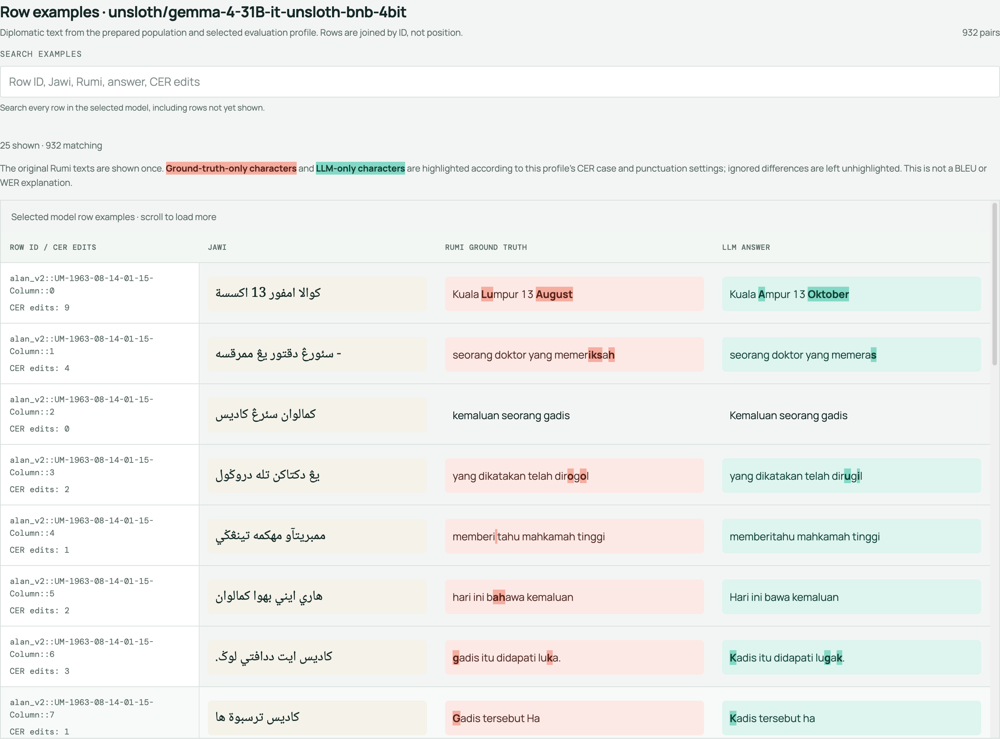

# Project - Jawi - Rumi

> **Imported Notion snapshot for review:** Content below comes from the owner's [“Jawi - Rumi” Notion page](https://app.notion.com/p/Jawi-Rumi-3e39789a0bf88066811bd04d8aa74315?pvs=21), via export. It is not approved team documentation or a live task tracker. `up` links to [The Jawi AI Project](../ongoing/Project%20-%20The%20Jawi%20AI%20Project.md); the Notion status “In progress” has been mapped to the status `active`.

## Purpose and outcome

*Track work on transliterating Jawi text to Rumi.*

## Where to act

*Do not duplicate issue assignments or issue status here. The project `status` property describes the project as a whole.*

- Code: [`culturalheritagenus/rumi-jawi`](https://github.com/culturalheritagenus/rumi-jawi)
- Issues: no specific issue link in the Notion export.

## Open actions

> **Edited Notion snapshot:** Task names below have been replaced with linked people placeholders; wording and due dates come from the export. Check the source and verify current state in GitHub before using these as follow-ups.

*Keep action items visible and updated with the most recent at the top. Move the completed actions into the completed section. Create separate tasks when relevant. Record Who, What, By when, Task (as applicable).*

- [ ]  [Who] — [What] (by [date, if agreed])
- [x]  [@Person 1](../../Atlas/Notes/People/@Person%201.md) Add the  sentences to the dashboard, Jawi, GT, and model answer 8 October 2026
- [ ]  [@Person 1](../../Atlas/Notes/People/@Person%201.md) Add a column to the data table for an annotator to describe the failure mode 8 October 2026

## Context and knowledge

### Original Notion properties

Assignee: Zé Miguel Vieira  
Person: Jose  
Status: In progress

### Resources

- Code: [`culturalheritagenus/rumi-jawi`](https://github.com/culturalheritagenus/rumi-jawi)
- Datasets
    - [`culturalheritagenus/rumi_data`](https://github.com/culturalheritagenus/rumi_data)
- [Jawi Romanization Table](https://www.loc.gov/catdir/cpso/romanization/jawi-pegon.pdf)

#### Models

## Decisions

_No decisions from the Notion export have been approved for this wiki. The dated updates are preserved below as source material._

## Project log

*Record dated developments and completed follow-ups, newest first. Link to sources and GitHub issues rather than copying issue updates; distinguish proposals from agreed decisions.*

### 2 October 2026

- Added a table with the Jawi/Rumi (ground truth)/LLM answer to the dashboard.
- Differences are highlighted using character diff between the Rumi and LLM answer.

- Ran two more evaluations, one with a prompt to explicitly not expand words ending in a reduplicating numeral, and another with a prompt that contains Jawi - Rumi rules. The no reduplication performed the best so far. 

### 1 October 2026

- Added a local evaluation dashboard to be able to compare results across different configurations and runs.
- Display the text data in the dashboard, Jawi, Rumi GT, and LLM answer, with a diff view.

### 25 September 2026

- Added more metrics for evaluation, BLEU, ROUGE.
- Added support for configurable evaluation metrics.

### 24 September 2026

| Model | GPU | VRAM | Time | CER | WER |
| --- | --- | --- | --- | --- | --- |
| [`unsloth/gemma-4-31B-it-unsloth-bnb-4bit`](https://huggingface.co/unsloth/gemma-4-31B-it-unsloth-bnb-4bit)  | 1 x A100 | 80 GB | 2.81s | **0.2010** | **0.4373** |
| `aisingapore/Gemma-SEA-LION-v3-9B-IT` | 1 x L40S | 48 GB | 1.29s | 0.5245 | 0.9331 |
| [`aisingapore/Gemma-SEA-LION-v4-27B-IT`](https://huggingface.co/aisingapore/Gemma-SEA-LION-v4-27B-IT)  | 1 x A100 | 80 GB | 1.34s | 0.297 | 0.6319 |
| `aisingapore/Gemma-SEA-LION-v4.5-E2B-IT` | 1 x L4 | 24 GB |  |  |  |
| `aisingapore/Qwen-SEA-LION-v4.5-27B-IT` | 1 x H200 | 141 GB | 3.47s | 11.6409 | 13.6212 |
- Transliterated **932 rows** across four models (missed the SEA-LION Gemmas v4.5 model in the list of endpoints!) using the system prompt:
    - *You are an expert in Malay. You will get a sentence in Jawi (Malay in the Arabic script). Convert this sentence to Rumi (Romanised Malay). Respond with the corrected sentence ONLY! DO NOT add anything else than the sentence.*
- The [`unsloth/gemma-4-31B-it-unsloth-bnb-4bit`](https://huggingface.co/unsloth/gemma-4-31B-it-unsloth-bnb-4bit) model performed best: **30.90%** normalised exact match, **CER 0.201**, **WER 0.437**.
- `aisingapore/Qwen-SEA-LION-v4.5-27B-IT` returned reasoning text instead of following the instructions in the prompt, that is the reason for the current poor scores.
    - Need to look at disabling thinking for next runs.

### 23 September 2026

#### Dataset audit

Set up a [notebook to audit the dataset](https://github.com/culturalheritagenus/rumi-jawi/tree/main/notebooks):

- There are **3,904** rows in total.
- Rumi **3,903** rows ; Jawi **932** rows.
- Only **932 rows (23.9%) are complete Jawi-Rumi pairs** suitable for transliteration evaluation.
- **2,971 rows (76.1%) are Rumi-only**; there are no Jawi-only rows and one row has neither text.
- Upstream validation (from validated column) marks **780 rows correct** and **263 incorrect**; 2,861 remain unvalidated.
- Review highlighted **23 possible misalignments**, **68 rows in 34 duplicated-pair groups**, **16 reduplication disagreements**, and five known `sami2` cases. These are review candidates, not confirmed errors.
- Next: create a deduplicated dataset from the 932 rows.
