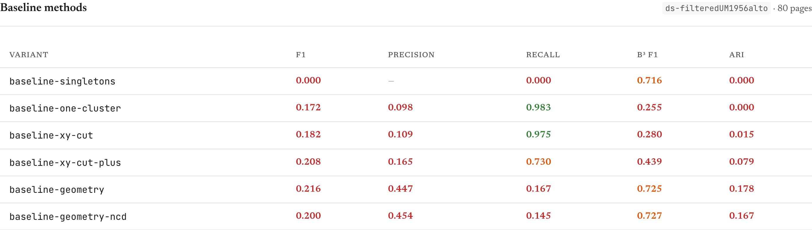
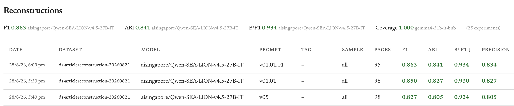
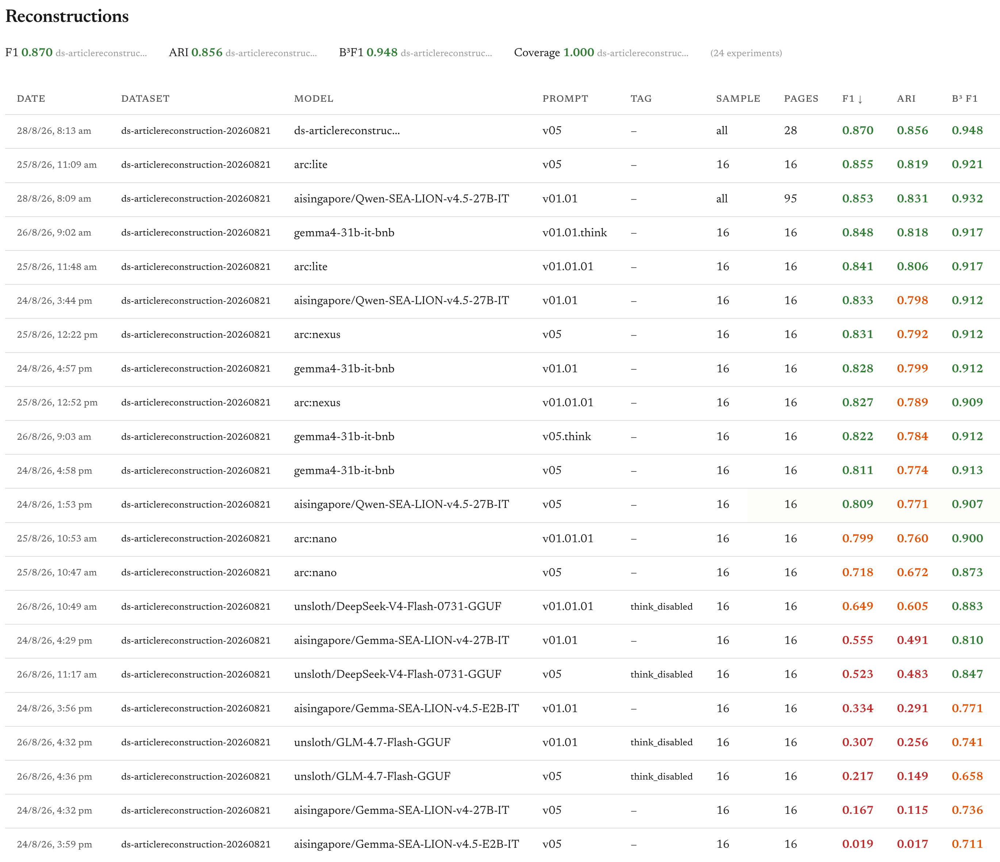
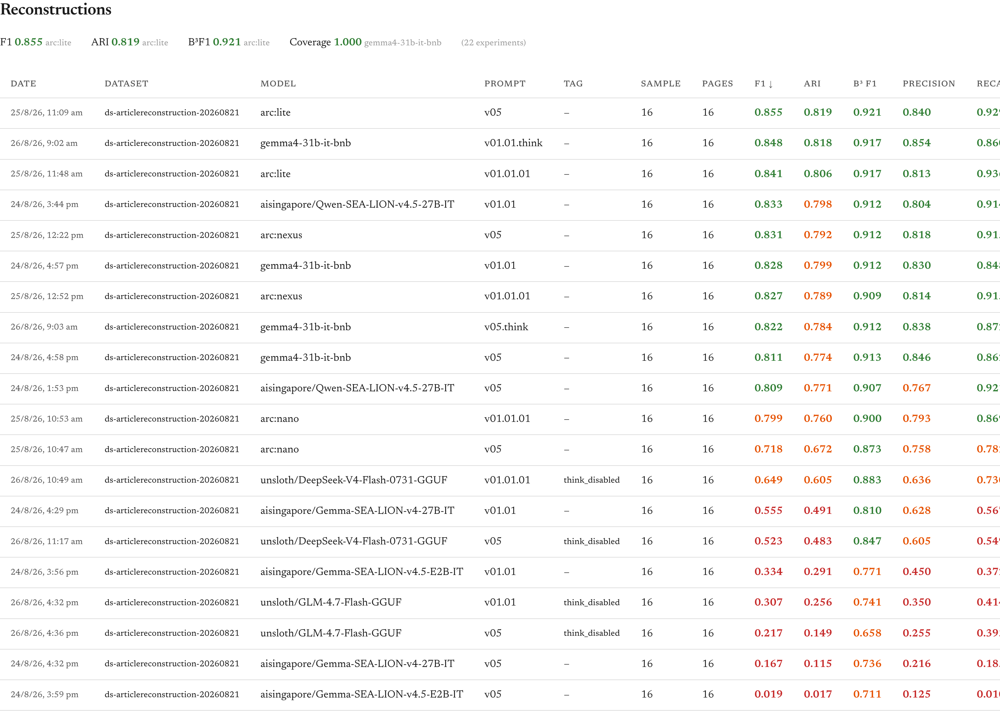
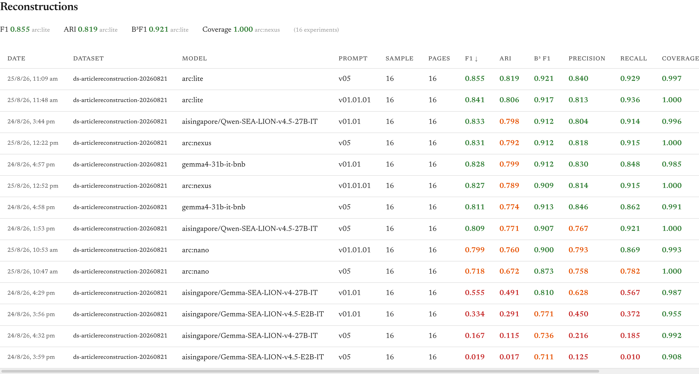
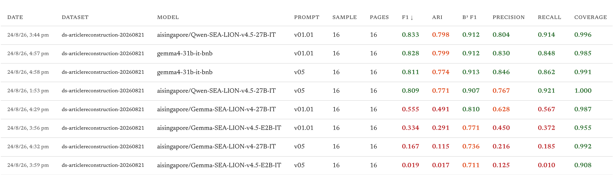

# Project - LLM based reconstruction

> **Imported Notion snapshot for review:** The material below is from the owner's [Notion page](https://app.notion.com/p/LLM-based-reconstruction-3af9789a0bf8801abf0af58cd6fd3719?pvs=21) and is not approved team documentation or a live task tracker. Its Notion priority “High” and status “In progress” have not been mapped to the wiki properties. Four raw OCR/model-completion excerpts were omitted; the six aggregate evaluation screenshots were included. This is a child of [The Jawi AI Project](../ongoing/Project%20-%20The%20Jawi%20AI%20Project.md).

## Purpose and outcome

Develop and evaluate a pipeline to reconstruct newspaper articles from OCR text fragments. (Source: Notion export, 4 August 2026.)

## Where to act

*Do not duplicate issue assignments or issue status here. The project `status` property describes the project as a whole.*

- Code: https://github.com/jmiguelv/newspaper-reconstructor
- Issues: no specific issue link in the Notion export.

## Open actions

> **Edited Notion snapshot:** Task names below have been replaced with linked people placeholders; other task wording comes from the export. Check the source and verify current state in GitHub before using these as follow-ups.

*Keep action items visible and updated with the most recent at the top. Move the completed actions into the completed section. Create separate tasks when relevant. Record Who, What, By when, Task (as applicable).*

- [ ] [Who] — [What] (by [date, if agreed])
- [ ]  [@Person 2](../../Notes/People/@Person%202.md) will run the pipeline for 1956 in the Schmidt cluster
- [ ]  [@Person 3](../../Notes/People/@Person%203.md) to compile new dataset with additional pages
- [ ]  ❓@all, How to organize all repos, ongoing
- Completed
    - [x]  [@Person 1](../../Notes/People/@Person%201.md) calculate agreement (only region ids), and process, [new dataset](https://github.com/culturalheritagenus/ds_article_20260902/)
    - [x]  [@Person 1](../../Notes/People/@Person%201.md) to change the prompt for article titles to be in Malay.
    - [x]  [@Person 1](../../Notes/People/@Person%201.md) to change the implementation to use Transformers
    - [x]  [@Person 1](../../Notes/People/@Person%201.md) and [@Person 2](../../Notes/People/@Person%202.md) to explore optimisations for batch inference
    - [x]  [@Person 1](../../Notes/People/@Person%201.md) adapt newspaper reconstructor module to implement the interface ``Module[ArticleReconstructionInput, ArticleReconstructionOutput]``
    - [x]  [@Person 1](../../Notes/People/@Person%201.md) to share inference time per model (and hardware specs)
    - [x]  [@Person 1](../../Notes/People/@Person%201.md) to finish benchmarking by 28 August 2026
    - [x]  [@Person 3](../../Notes/People/@Person%203.md) prompts for [@Person 1](../../Notes/People/@Person%201.md), by 24 August 2026
    - [x]  [@Person 3](../../Notes/People/@Person%203.md) give [@Person 1](../../Notes/People/@Person%201.md) HuggingFace access
    - [x]  [@Person 3](../../Notes/People/@Person%203.md) to review ground truth data
    - [x]  [@Person 1](../../Notes/People/@Person%201.md) share updated newspaper reconstructor repository
    - [x]  [@Person 1](../../Notes/People/@Person%201.md) add ARI
    - [x]  Generate format compatible with article-network-visualizer
    - [x]  [@Person 4](../../Notes/People/@Person%204.md) to complete handover

## Context and knowledge

### Original Notion properties

Assignee: Zé Miguel Vieira, Yash  
Date started: 29 July 2026  
Part of: Article  
Person: Jose, Yash  
Priority: High  
Status: In progress

> [!warning] Notion note
> Note: I found on 3 October 2026 that the extraction of the OCR’d lines is sometimes random in terms of sequence and we should double check this before running this pipeline. — Miguel

### Resources

- Datasets
    - [20260821](https://github.com/culturalheritagenus/ds-articlereconstruction-20260821)
    - [20260902](https://github.com/culturalheritagenus/ds_article_20260902/)
- Code: https://github.com/jmiguelv/newspaper-reconstructor
- https://vramcalculator.com/

### Inference times

> [!note] Notion note
> *Note, that the hardware for the models was already set up before all these experiments were run.*

| Model | GPU | VRAM | Time | Average B³ F1 |
| --- | --- | --- | --- | --- |
| `aisingapore/Qwen-SEA-LION-v4.5-27B-IT` | 1 x H200 | 141 GB | 8s | 0.921 |
| `arc:lite` (Qwen 3.8, medium thinking) | No details | - | 89s | 0.918 |
| `gemma4-31b-it-bnb` | 1 x A100 | 80 GB | 46s | 0.914 |
| `aisingapore/Gemma-SEA-LION-v4-27B-IT` | 1 x A100  | 80 GB | 35s | 0.773 |
| `aisingapore/Gemma-SEA-LION-v4.5-E2B-IT`  | 1 x L4 | 24 GB | 24s | 0.741 |

> [!info]- Child projects
> ```base
> views:
>   - type: table
>     name: Children projects
>     filters:
>       and:
>         - file.hasProperty("up")
>         - file.properties.up == this.file.name
>     order:
>       - file.name
>       - status
>       - priority
>     sort:
>       - property: status
>         direction: ASC
>     columnSize:
>       file.name: 289
>       note.status: 193
>     indentProperties: true
> ```

## Decisions

_No decisions in the Notion export have been approved for this wiki. Discussions in the dated notes remain source material until reviewed._

## Project log

*Record dated developments and completed follow-ups, newest first. Link to sources and GitHub issues rather than copying issue updates; distinguish proposals from agreed decisions.*

### 22 September 2026

| Model | Training variant | Context | Validation F1 | Test F1 | Original region-level test F1 |
| --- | --- | --- | --- | --- | --- |
| DistilBERT multilingual | baseline | 512 | 0.7416 | 0.7477 | 0.7477 |
| DistilBERT multilingual | split400 | 512 | 0.7471 | 0.7038 | 0.6723 |
| DistilBERT multilingual | split400-filtered | 512 | 0.7629 | 0.7224 | 0.7111 |
| DistilBERT multilingual | split400-cross | 512 | 0.7482 | 0.7327 | 0.6724 |
| SEA-LION ModernBERT-300M | baseline | 512 | 0.8000 | 0.7658 | 0.7658 |
| SEA-LION ModernBERT-300M | baseline | 8,192 | 0.7583 | 0.7692 | 0.7692 |
| SEA-LION ModernBERT-300M | split400-filtered | 8,192 | 0.7067 | 0.7148 | 0.7094 |
| **SEA-LION ModernBERT-300M** | **split400-cross** | **8,192** | **0.8405** | **0.8333** | **0.8042** |

> [!note] Notion note
> Fine-tuning `SEA-LION ModernBERT-300M` on a Mac G5 Pro with 48GB took ~7h.

| Variant | Split at 400 | Filter gibberish | Negatives restricted across source regions |
| --- | --- | --- | --- |
| `split400` | Yes | No | No |
| `split400-filtered` | Yes | Yes | No |
| `split400-cross` | Yes | No | Yes |
| `split400-cross-filtered` | Yes | Yes | Yes, not run |

### 21 September 2026

Tested whether splitting long OCR regions into ≤400-character sub-fragments could improve continuation
classification. This expanded the dataset from 1,162/234/198 to 2,432/536/546 train/validation/test
pairs while preserving page-disjoint splits.

With this, `SEA-LION ModernBERT-300M` achieved a new best result on the original held-out test
set:

- **F1: 0.804** vs 0.766 baseline
- **Average precision: 0.899** vs 0.808
- **ROC-AUC: 0.904** vs 0.827

A control trained on the original unsplit data with the same 8,192-token context reached only an **F1 of 0.769**, suggesting that the improvement comes mainly from the expanded dataset, not simply the larger context window. DistilBERT did not benefit in the same way, suggesting the larger ModernBERT model is better able to learn from the additional continuation examples.

### 18 September 2026

- Fine-tuned `aisingapore/SEA-LION-ModernBERT-300M` on the same binary continuation task and setup as `distilBERT`:
    - Training took about **9 minutes** on MPS
    - Validation: **F1 0.783**, Average Precision (AP) 0.868, ROC-AUC 0.878
    - Test: **F1 0.732**, AP 0.840, ROC-AUC 0.841
    - Test precision: **0.747;** recall **0.717**
- The `SEA-LION` model is stronger on validation, the SEA focused tokenizer and pre-training seem to help with the context.
- During test it came slightly behind `distilBERT` on F1, but the gap is not conclusive, in particular because at 3 epochs the `SEA-LION` model was still improving (val F1 0.44 → 0.58 → 0.78, loss still dropping), so it is likely undertrained. A follow up with 5 epochs might clarify things.
- Retrained SEA-LION with 5 epochs (best checkpoint still epoch 3, validation **F1 0.80**). Test **F1 0.766;** now ahead of DistilBERT (0.748). Test AP 0.808, ROC-AUC 0.827.

### 17 September 2026

- Build a BERT based continuation classifier, for binary prediction of whether region B immediately continues region A.
- Created a local dataset, from `ds-articlereconstruction-20260821` , for the experiment with 70/15/15 splits. The training data has around ~1200 pairs.
- Fine-tuned a small model, `distilbert/distilbert-base-multilingual-cased` for 3 epochs:
    - Training took about **159 seconds** on MPS
    - Validation: **F1 0.742**, Average Precision (AP) 0.713, ROC-AUC 0.761
    - Test: **F1 0.748**, AP 0.800, ROC-AUC 0.792
    - Test precision: **0.696;** recall **0.808**
- Next steps, test with a model that has larger support for local languages, such as `aisingapore/SEA-LION-ModernBERT-300M`

### 16 September 2026

#### Baseline methods

Added and evaluated six article-reconstruction baseline methods. Geometry performed best, but remains substantially below the LLM results.



> [!note] Notion note
> Used the older,  `ds-filteredUM1956alto` dataset because its raw module-format OCR contains the full region coordinates needed by the geometry baselines.

### 14 September 2026, 15 September 2026

Exploring, non-LLM, baseline methods of clustering, like geometry clustering and XY-Cut.

### 10 September 2026

- All have been processed (bad ocr removed manually). In the future, we might need to adjust the prompt.

### 9 September 2026

- All, but one page, have been reconstructed for 1956
- The page `UM-1956-09-23-5` is failing to process because the LLM is hitting an end-of-text token during the reasoning phase.
    
    *Raw OCR/model-completion excerpt omitted from wiki; see original Notion export for source data.*
    
- The `stop_reason` refers to token ID 248044, which is `<|endoftext|>`, causing the content to terminate abruptly.
- There's some string repetition, but most of the content is Jawi:

```bash
page                      n   chars  prompt maxfrag   jawi  ascii  gib  dup  rep
--------------------------------------------------------------------------------
UM-1956-09-23-5           9    3920    4465    1734   0.98   0.02    0    0    3
```

- Might need to tweak the `frequency_penalty`, removing it altogether causes the API request to timeout after 900 seconds.
- With a `frequency_penalty` of 1, the page gets processed, but no article reconstructions are returned. The API response is below. The LLM started looping, turned into a zombie, and it started swearing, and there's also some valid Braingf*ck code in the end (an empty loop, followed by increment and decrement pointer commands according to [Brainfuck.net - Interpreter, Encoder & Debugger](https://brainfuck.net/))
    
    *Raw OCR/model-completion excerpt omitted from wiki; see original Notion export for source data.*
    
- After removing that fragment, the LLM was able to process the page!
- Maybe we need a step in between the OCR pipeline and the reconstructions pipeline that checks the quality of the OCR in the fragments, flags potential problems, and potentially removed them.

#### Annotator agreement

- Ran the annotator `agreement.py` script to compare the annotations in the dataset [ds_article_20260902](https://github.com/culturalheritagenus/ds_article_20260902). There was only full agreement on 12 out of 80 pages:
    - UM-1961-01-08-11
    - UM-1961-01-08-3
    - UM-1961-01-08-9
    - UM-1962-04-13-2
    - UM-1962-04-13-3
    - UM-1962-04-13-9
    - UM-1963-08-31-3
    - UM-1964-12-16-2
    - UM-1964-12-16-3
    - UM-1966-07-12-2
    - UM-1966-07-12-9
    - UM-1967-02-19-2

### 8 September 2026

- Reconstruction of 1956, *Clustered 2607/2720 files to data/1_interim/1956_ocr_out_20260907/reconstructions/1956_ocr_out_20260907_huggingface_aisingapore_Qwen-SEA-LION-v4.5-27B-IT_r-v01.01.02 in 25162.9s*
- That was ~9s per file, including the time retrying files that timed out
- Increasing the `timeout=900` and the `frequency_penalty=1.2` helped process more pages, but there are still issues, `Failed to cluster UM-1956-02-11-6.json\n Failed to parse LLM response as JSON array after 3 attempts`
    - More pages have been processed, but there are still errors because the LLM is spending too many tokens *thinking*
    - One of those pages has bad content in one of the fragments:
        
        *Raw OCR/model-completion excerpt omitted from wiki; see original Notion export for source data.*
        
    - Creating a script to display page fragment stats, there are quite a few pages with potential OCR issues
    
    ```bash
    Top 20 pages by gibberish_fragments:
    page                 n   chars  prompt maxfrag   jawi  ascii  gib  dup  rep
    ---------------------------------------------------------------------------
    UM-1956-05-10-7    117    7808   14830     173   0.76   0.24   40    0    2
    UM-1956-05-10-8     85    9585   14687    2116   0.81   0.19   25    0    4
    UM-1956-09-22-2     58    8991   12479     911   0.61   0.39   11    0    3
    UM-1956-05-10-6     61    8171   11833     454   0.90   0.10    6    0    2
    UM-1956-08-29-4     30   11995   13802    3283   0.92   0.07    6    0   11
    UM-1956-12-03-4     28   10637   12320    3223   0.83   0.17    5    0   14
    UM-1956-02-24-2     24    5429    6873     517   0.85   0.14    4    0    2
    UM-1956-02-27-3     29   12537   14280    4255   0.65   0.35    4    0    3
    UM-1956-03-21-6     30    9235   11038     701   0.87   0.13    4    0    3
    UM-1956-03-25-1     28    9594   11281     938   0.89   0.11    4    0    3
    UM-1956-03-27-1     33   12307   14296    1271   0.95   0.04    4    0    3
    UM-1956-04-01-1     30   10880   12684    1359   0.91   0.09    4    0    3
    UM-1956-04-16-7     36   11779   13945    4260   0.56   0.44    4    0    2
    UM-1956-05-11-6     28    4244    5928     869   0.73   0.27    4    0    1
    UM-1956-07-10-5     25    4660    6163     497   0.94   0.06    4    0    2
    UM-1956-08-04-4     31   12592   14455    3821   0.92   0.08    4    0    7
    UM-1956-08-11-4     32   10818   12744    3298   0.93   0.06    4    0    4
    UM-1956-10-10-8     30    6835    8642    1080   0.91   0.09    4    0    4
    UM-1956-11-08-6     34    9372   11417     588   0.92   0.08    4    0    2
    UM-1956-01-09-1     30   10499   12306    1426   0.97   0.03    3    0    3
    ```
    
    - Increasing the `max_tokens` solved the issue for the remaining pages, but one page still failed to process `UM-1956-09-23-5`

### 7 September 2026

- Investigating issue with `Qwen-SEA-LION` and `transformers`
- Implementing annotator agreement across two datasets
- Set up pipeline to run reconstruction for 1956 year of data using `aisingapore/Qwen-SEA-LION-v4.5-27B-IT` on HuggingFace

### 4 September 2026

- Implemented support for local models and pipeline module
- Created a sample experiment to test the use of local models

### 3 September 2026

- Meeting
    - Adjust the best prompt to add the title to the reconstructed articles
    - Adapt the module to support running inference via local transformers
    - Implement the pipeline interface
- Starting implementing pipeline interface and support for local models

### 2 September 2026

- Project review and implementation of improvements suggested by agentic review.
- New dataset, [`ds_article_20260902`](https://github.com/culturalheritagenus/ds_article_20260902/), needs annotator agreement verification across regions and topics.
- Started planning on how to adapt the newspaper reconstructor to implement the interface ``Module[ArticleReconstructionInput, ArticleReconstructionOutput]``

### 1 September 2026

Tidying up dashboard. Manual test to see if passing images to the LLMs together with the prompt improves the metrics for the worst performing pages, but unfortunately it doesn’t. Even though the model looked at the image to reason, it still output the same article groupings as when no image was provided.

### 31 August 2026

Finish refactoring related to processing improvements, and record inference times and hardware for each of the models. Added a new command, `plan`, to help with estimating the amount of VRAM needed to process a single page.

```bash
$ uv run python main.py plan --input data/1_interim/ds-articlereconstruction-20260821/fragments

Analyzed 98 pages in 'data/1_interim/ds-articlereconstruction-20260821/fragments'.
Average fragments per page: 20.4
Average characters per page: 7759.5
Estimated input tokens per page: 3,104 (assuming ~2.5 chars/token)

To estimate precise VRAM requirements for a 16K output budget, visit: https://vramcalculator.com/
```

### 28 August 2026

Discussion of results and deciding on next steps.

Looking into settings to tweak vLLM inference endpoint performance. Increased the `VLLM_GPU_MEMORY_UTILIZATION` (tells vLLM to safely claim 95% of the 141GB VRAM for KV cache) to `0.95` via an environmental variable in the admin interface. 

Also modified the default Python processing to parallelise the requests to the VM, via a `--max-workers` parameter. This parallelisation greatly reduced the processing time of the total pages, 98, to roughly 13 minutes when sending 32 concurrent requests (the H200/141G can probably handle more concurrent requests, as the max KV cache usage is still under 40%).

I have also introduced a `--max-tokens` parameter to stop the model from repeating itself when it encounters pages with bad OCR, such as `UM-1956-05-02-1.json`.  

- Expand to see the reasoning for that page.
    
    *Raw OCR/model-completion excerpt omitted from wiki; see original Notion export for source data.*
    



### 27 August 2026

Re-running the experiment using the full dataset against `aisingapore/Qwen-SEA-LION-v4.5-27B-IT`. It burned through the remaining credits in Inference Endpoints. Only prompt `v01.01` was able to finish the processing.



### 26 August 2026

Running experiments against Unsloth’s `Gemma` again, but with reasoning enabled this time. Reasoning is [enabled by adding `<|think|>`](https://unsloth.ai/docs/models/gemma-4#simple-reasoning-prompt) at the top of the system prompt.

- Gemma with thinking is now the second-best performing model when using prompt `v01.01`. Both reasoning prompts perform better than their non-thinking counterparts. However, unlike with the Qwen models where the simpler prompt had the advantage, Gemma still maintains an edge with the more guided prompt. Interestingly, the standard `v01.01` prompt without reasoning is still better than the simpler `v05` prompt with thinking enabled for Gemma.
- [`unsloth/DeepSeek-V4-Flash-0731-GGUF`](https://huggingface.co/unsloth/DeepSeek-V4-Flash-0731-GGUF), with three reasoning modes, no reasoning, `high`, and `max`. No reasoning didn't produce great results, above The Gemma SEA-LION models, for prompt `v01.01`. I stopped the experiments with reasoning modes, because they were taking too long and requests kept timing out.
- `unsloth/GLM-4.7-Flash-GGUF`, testing with both no reasoning and reasoning modes, but it seems to be very slow. Stopped the reasoning runs because it's extremely slow, similar to the `DeepSeek` model. The results were not great either and performed worse than `DeepSeek`.
    
    
    

> [!note] Notion note
> I think enough models have been tested, unless someone can think of anything in particular. Sticking with the top performers for now (`arc:lite`, `gemma4-31b-it-bnb`, and `Qwen-SEA-LION`). Next step could be to expand the sample size or try classifying the fragments before clustering, to see if that gives them an advantage before retrying the reconstruction.

### 25 August 2026

Running experiments against [`Qwen 3.8 27B`](https://huggingface.co/Qwen/Qwen3.8-27B) , with two reasoning modes, `low` and `medium` , and no reasoning.

- Had to tweak prompt `v01.01` because it was making Qwen [overthink](https://simonwillison.net/2026/Aug/16/qwen-38-27b/)! The requests were taking ages to complete per page, 15+ minutes and counting.
- The introduction of `Qwen 3.8 27B` reasoning model, resulted in a new best performing model, surpassing the Unsloth `Gemma` and `Qwen-SEA-LION`.
- The low-thinking variant, `arc:lite`, is the current best performer across the board, suggesting light reasoning might be ideal for this task, while excessive chain-of-thought may lead to over-complication. The no-thinking variant, `arc:nano`, trailed behind, confirming that some reasoning capabilities are advantageous.
- Interestingly, the ability to reason flips the prompt preference. The reasoning models (`lite` and `nexus`) achieved their best results using the simpler `v05` prompt, likely because it allowed them to structure their own logical grouping without being constrained. On the other side, the non-reasoning model (`nano`) suffered a performance drop when using `v05` and heavily relied on the more detailed instructions in `v01.01.01`.
    
    
    

### 24 August 2026

- Models to try:
    - Sealion
    - Gemma
    - Nemotron
    - Qwen

| Model | Endpoint |
| --- | --- |
| [aisingapore/Qwen-SEA-LION-v4.5-27B-IT](https://huggingface.co/aisingapore/Qwen-SEA-LION-v4.5-27B-IT) | [https://endpoints.huggingface.co/culturalheritagenus/endpoints/qwen-sea-lion-v4-5-27b-it-yyp](https://endpoints.huggingface.co/culturalheritagenus/endpoints/qwen-sea-lion-v4-5-27b-it-yyp) |
| [aisingapore/Gemma-SEA-LION-v4.5-E2B-IT](https://huggingface.co/aisingapore/Gemma-SEA-LION-v4.5-E2B-IT) (any-to-any) | [https://endpoints.huggingface.co/culturalheritagenus/endpoints/gemma-sea-lion-v4-5-e2b-it-pvp](https://endpoints.huggingface.co/culturalheritagenus/endpoints/gemma-sea-lion-v4-5-e2b-it-pvp) |
| `unsloth/gemma-4-31B-it-unsloth-bnb-4bit` (Quantized Gemma 4) | [https://endpoints.huggingface.co/culturalheritagenus/endpoints/gemma-4-31b-it-unsloth-bnb-4-gpe](https://endpoints.huggingface.co/culturalheritagenus/endpoints/gemma-4-31b-it-unsloth-bnb-4-gpe) |
| [aisingapore/Gemma-SEA-LION-v4-27B-IT](https://huggingface.co/aisingapore/Gemma-SEA-LION-v4-27B-IT) | [https://endpoints.huggingface.co/culturalheritagenus/endpoints/gemma-sea-lion-v4-27b-it-gct](https://endpoints.huggingface.co/culturalheritagenus/endpoints/gemma-sea-lion-v4-27b-it-gct) |
- Ran two [experiments](https://github.com/jmiguelv/newspaper-reconstructor/blob/870b3a15f09f253a196bb49b01a969edde20e180/experiments/hf_without_classification_20260824.sh) agains each of the models in the table above, one using @Miguel Varela’s prompt ([v05](https://github.com/jmiguelv/newspaper-reconstructor/blob/main/prompts/v05.md)), the other using a previously tuned prompt ([v01.01](https://github.com/jmiguelv/newspaper-reconstructor/blob/main/prompts/v00.01.md)). `Qwen-SEA-LION` was the best performing one, followed by Unsloth’s `Gemma`. The `Gemma-SEA-LION` models were both quite bad in comparison.
    
    
    
- Regarding the prompts, the previously tuned `v01.01` produced better results compared to v05. The drop in performance was relatively minor for the top two models, but using v05 caused a complete performance collapse for both of the `Gemma-SEA-LION` models. If we look at `B³F1`, however, it's a different story: `v05` paired with Unsloth's `Gemma` actually achieved the highest score out of all runs.

### 12 August 2026

- @Miguel Varela / @Zé Miguel Vieira on next steps
    - Finalise dashboard refactoring and share
    - Try the pipeline with larger models
    - Article JSON to be added to the GT dataset
        - [Python snippet to convert ALTO to JSON](https://github.com/jmiguelv/newspaper-reconstructor/blob/e118e9cbddbb0f0b92e9c6668e43c675bdc65b0d/src/newspaper_reconstructor/reconstruct.py#L22)

### 11 August 2026

- @Zé Miguel Vieira
    - Finished refactoring the pipeline into multi-step, with classification first and then reconstruction. Having the classification doesn’t seem to make much different to the final reconstruction metrics.
    - Added ARI as a metric to the reconstruction results.

### 7 August 2026

- Refactoring the pipeline to multi-step, classification then reconstruction (same approach as used in the video segmentation project). Separate prompts for each stage to see if we can improve output quality, especially for smaller models.
    - Define a classification prompt and adapt the reconstruction prompt
- Computationally distinguishing between titles and proper article candidates at preprocessing?
- Transliterate, translate or summarize first?
- Does the order matter? And how?
- Why does page id have a prefix?
    - Just inside the alto, not in the filename

### 6 August 2026

@Yash Re-running the newspaper reconstructor with the larger LLM.

- Prompts:
    - [https://github.com/culturalheritagenus/articlereconstruction-zeroshot-promps](https://github.com/culturalheritagenus/articlereconstruction-zeroshot-promps)
- Datasets:
    - Prompt 2, Input is a flat list of id-tagged regions with original region ids: [https://github.com/culturalheritagenus/ds-articlereconstruction-68265810-2026-08-05](https://github.com/culturalheritagenus/ds-articlereconstruction-68265810-2026-08-05).
        - ARI = 82
    - Prompt 3: Input is a JSON of regions with original region ids: [https://github.com/culturalheritagenus/ds-articlereconstruction-92bcef77-2026-08-06](https://github.com/culturalheritagenus/ds-articlereconstruction-92bcef77-2026-08-06)
        - ARI = 84
    - Prompt 4: Input is a JSON of regions with truncated region ids: [https://github.com/culturalheritagenus/ds-articlereconstruction-68265810-2026-08-06](https://github.com/culturalheritagenus/ds-articlereconstruction-68265810-2026-08-06/tree/main).
        - ARI = 83
    - Prompt 5: Input is a JSON of regions with letter-aliased region ids: [https://github.com/culturalheritagenus/ds-articlereconstruction-1629e37d-2026-08-06](https://github.com/culturalheritagenus/ds-articlereconstruction-1629e37d-2026-08-06)
        - ARI = 86

---

by @Zé Miguel Vieira 

**LLM as a judge,** set up a `suggest` task for the LLM to evaluate and reason on how to improve the reconstruction by passing reconstructions results.

- Suggestions included more specific prompts and sorting the fragments before passing them to the LLM, but neither produced better results than the initial prompt!
- Ran the reconstruction on the largest model available, `GLM 5.2`, as a quick experiment, and the F1 increased to 0.85 (from 0.80) and the B3F1 increase to 0.93 (from 0.90).

### 5 August 2026

Added a new module that can be used to convert an evaluation into the format expected by the network visualiser, https://github.com/jmiguelv/newspaper-reconstructor/blob/main/generate_network.py

Made a local change to the `article-network-visualiser`to make it easier to distinguish which edges are false positives by using an `edge_weight` value in the edges CSV. 

### 4 August 2026

- [https://github.com/jmiguelv/newspaper-reconstructor](https://github.com/jmiguelv/newspaper-reconstructor)
- Built an end-to-end pipeline for article reconstruction from text fragments. The pipeline parses ALTO XML outputs into text blocks, sends them to an LLM (either `Gemma4:26B-A4B` or `Qwen3.6-35B-A3B`) with structured prompts, and groups the fragments into reconstructed items. Evaluation compares the model's predicted groupings against ground-truth article XML using several metrics, including F1, class accuracy, and coverage. An interactive evaluation dashboard was built alongside to compare runs, sort by metrics, inspect individual pages, and review the prompt templates used.
- Several prompt variants were tested. The smaller model ran reliably across all variants and sample sizes, achieving consistent F1 scores around 0.75, class accuracy ~0.78, and coverage ~0.97. The larger model showed stronger metric scores on completed pages (F1 up to 0.80, class accuracy up to 0.82) but suffered from frequent 504 Gateway Timeout errors from the upstream server, causing many pages to be skipped (something on the API endpoint side).
- **Possible Next steps:** Try to run the larger model evaluations once the API is more stable to get complete coverage across all prompt variants, and use the per-page dashboard drill-down to analyse error patterns and guide further prompt iteration.

### 3 August 2026

- Waiting for compute
- Possible Solutions:
    - Use topology to break off spatially discontiguous clusters
    - Ask prompt to consider titles, and class.
    - Ask prompt to take into account that the segments could be titles, advertisements, obituaries, graphical information (coordinates, font-size).
    - Include edge data.
    - Increase context length

### 31 July 2026

Tentative ARI is 85%. Repo for code and dataset. 

- Code: [https://github.com/culturalheritagenus/exp-articlereconstruction-immediateclustering](https://github.com/culturalheritagenus/exp-articlereconstruction-immediateclustering)
- Dataset: [https://github.com/culturalheritagenus/ds-articlereconstruction-68265810-2026-07-31](https://github.com/culturalheritagenus/ds-articlereconstruction-68265810-2026-07-31)

Notes from MEV: it groups together adverts, and spatially distant regions.
